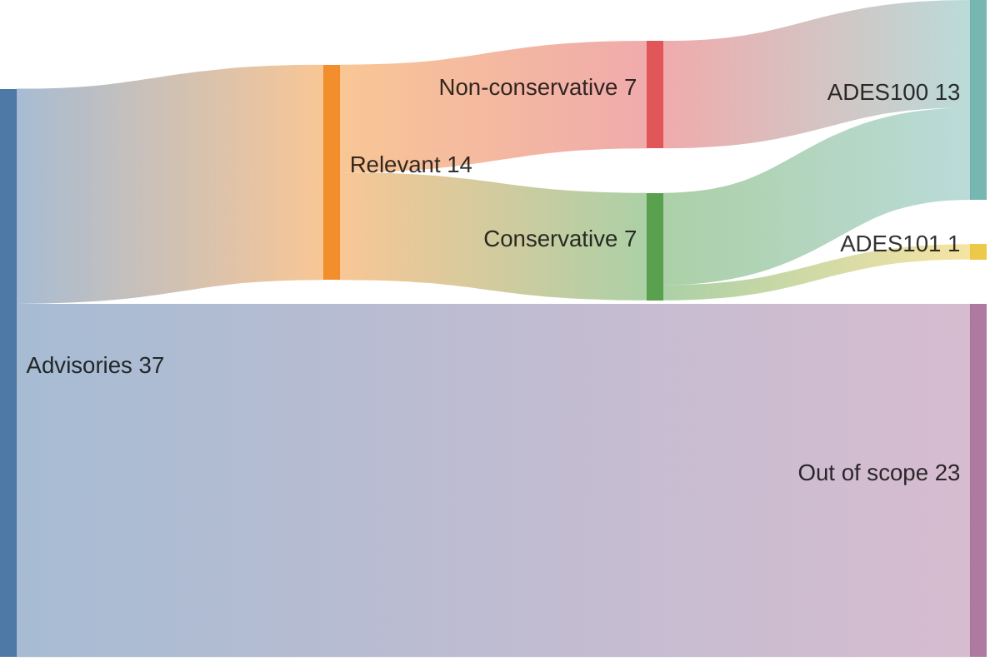

<!-- SPDX-License-Identifier: GFDL-1.3-or-later -->

# Evaluation

This document presents an evaluation of `ades` against real-world security incidents in the GitHub
Actions ecosystem. All (relevant) advisories and incidents are included in the `ades` test suite,
see [`advisories.txtar`].

You are welcome to contribute to this evaluation by adding missing advisories or incidents, issueing
corrections, clarifying the description, directly or otherwise through a [GitHub issue].

[`advisories.txtar`]: ../test/advisories.txtar
[github issue]: https://github.com/ericcornelissen/ades/issues/new?template=documentation.yml

## Advisories

The table below presents an overview of [GitHub Actions Advisories] and how they related to `ades`.

Here "Relevant" means the vulnerability is caused by the insecure use of GitHub Actions Expressions,
"Detected" indicates the vulnerability is detected by `ades` with the default configuration, and
"Conservative" indicates if the problem is detected by `ades` when using the `-conservative` flag.

|   # | Advisory              | Relevant | Detected | Conservative | Rule      |
| --: | :-------------------- | :------- | :------- | :----------- | :-------- |
|  36 | [GHSA-vxmw-7h4f-hqxh] | Yes      | Yes      | No           | [ADES100] |
|  35 | [GHSA-f79p-9c5r-xg88] | Yes      | Yes      | No           | [ADES100] |
|  34 | [GHSA-65rg-554r-9j5x] | Yes      | Yes      | No           | [ADES100] |
|  33 | [GHSA-x6gv-2rvh-qmp6] | No       |          |              |           |
|  32 | [GHSA-gq52-6phf-x2r6] | No       |          |              |           |
|  31 | [GHSA-c5qx-p38x-qf5w] | No       |          |              |           |
|  30 | [GHSA-mj96-mh85-r574] | No       |          |              |           |
|  29 | [GHSA-phf6-hm3h-x8qp] | Yes      | Yes      | Yes          | [ADES100] |
|  28 | [GHSA-m32f-fjw2-37v3] | No       |          |              |           |
|  27 | [GHSA-2487-9f55-2vg9] | Yes      | Yes      | Yes          | [ADES100] |
|  26 | [GHSA-mxr3-8whj-j74r] | No       |          |              |           |
|  25 | [GHSA-26wh-cc3r-w6pj] | No       |          |              |           |
|  24 | [GHSA-qmg3-hpqr-gqvc] | No       |          |              |           |
|  23 | [GHSA-mrrh-fwg8-r2c3] | No       |          |              |           |
|  22 | [GHSA-vqf5-2xx6-9wfm] | No       |          |              |           |
|  21 | [GHSA-5xr6-xhww-33m4] | No       |          |              |           |
|  20 | [GHSA-g85v-wf27-67xc] | No       |          |              |           |
|  19 | [GHSA-cxww-7g56-2vh6] | No       |          |              |           |
|  18 | [GHSA-7x29-qqmq-v6qc] | Yes      | Yes      | Yes          | [ADES100] |
|  17 | [GHSA-xj87-mqvh-88w2] | Yes      | Yes      | No           | [ADES100] |
|  16 | [GHSA-7f32-hm4h-w77q] | No       |          |              |           |
|  15 | [GHSA-ghm2-rq8q-wrhc] | Yes      | Yes      | No           | [ADES100] |
|  14 | [GHSA-mcph-m25j-8j63] | Yes      | Yes      | No           | [ADES100] |
|  13 | [GHSA-99jg-r3f4-rpxj] | No       |          |              |           |
|  12 | [GHSA-8v8w-v8xg-79rf] | Yes      | Yes      | Yes          | [ADES100] |
|  11 | [GHSA-hw6r-g8gj-2987] | Yes      | Yes      | Yes          | [ADES100] |
|  10 | [GHSA-h3qr-39j9-4r5v] | No       |          |              |           |
|   9 | [GHSA-rg3q-prf8-qxmp] | Yes      | Yes      | No           | [ADES100] |
|   8 | [GHSA-6q4m-7476-932w] | Yes      | Yes      | Yes          | [ADES100] |
|   7 | [GHSA-p756-rfxh-x63h] | No       |          |              |           |
|   6 | [GHSA-2c6m-6gqh-6qg3] | No       |          |              |           |
|   5 | [GHSA-f9qj-7gh3-mhj4] | No       |          |              |           |
|   4 | [GHSA-4xqx-pqpj-9fqw] | No       |          |              |           |
|   3 | [GHSA-634p-93h9-92vh] | No       |          |              |           |
|   2 | [GHSA-g86g-chm8-7r2p] | No       |          |              |           |
|   1 | [GHSA-4mgv-m5cm-f9h7] | No       |          |              |           |

[GitHub Actions Advisories]: https://github.com/advisories?query=type%3Areviewed+ecosystem%3Aactions

[GHSA-vxmw-7h4f-hqxh]: https://github.com/advisories/GHSA-vxmw-7h4f-hqxh
[GHSA-f79p-9c5r-xg88]: https://github.com/advisories/GHSA-f79p-9c5r-xg88
[GHSA-65rg-554r-9j5x]: https://github.com/advisories/GHSA-65rg-554r-9j5x
[GHSA-x6gv-2rvh-qmp6]: https://github.com/advisories/GHSA-x6gv-2rvh-qmp6
[GHSA-gq52-6phf-x2r6]: https://github.com/advisories/GHSA-gq52-6phf-x2r6
[GHSA-c5qx-p38x-qf5w]: https://github.com/advisories/GHSA-c5qx-p38x-qf5w
[GHSA-mj96-mh85-r574]: https://github.com/advisories/GHSA-mj96-mh85-r574
[GHSA-phf6-hm3h-x8qp]: https://github.com/advisories/GHSA-phf6-hm3h-x8qp
[GHSA-m32f-fjw2-37v3]: https://github.com/advisories/GHSA-m32f-fjw2-37v3
[GHSA-2487-9f55-2vg9]: https://github.com/advisories/GHSA-2487-9f55-2vg9
[GHSA-mxr3-8whj-j74r]: https://github.com/advisories/GHSA-mxr3-8whj-j74r
[GHSA-26wh-cc3r-w6pj]: https://github.com/advisories/GHSA-26wh-cc3r-w6pj
[GHSA-qmg3-hpqr-gqvc]: https://github.com/advisories/GHSA-qmg3-hpqr-gqvc
[GHSA-mrrh-fwg8-r2c3]: https://github.com/advisories/GHSA-mrrh-fwg8-r2c3
[GHSA-vqf5-2xx6-9wfm]: https://github.com/advisories/GHSA-vqf5-2xx6-9wfm
[GHSA-5xr6-xhww-33m4]: https://github.com/advisories/GHSA-5xr6-xhww-33m4
[GHSA-g85v-wf27-67xc]: https://github.com/advisories/GHSA-g85v-wf27-67xc
[GHSA-cxww-7g56-2vh6]: https://github.com/advisories/GHSA-cxww-7g56-2vh6
[GHSA-7x29-qqmq-v6qc]: https://github.com/advisories/GHSA-7x29-qqmq-v6qc
[GHSA-xj87-mqvh-88w2]: https://github.com/advisories/GHSA-xj87-mqvh-88w2
[GHSA-7f32-hm4h-w77q]: https://github.com/advisories/GHSA-7f32-hm4h-w77q
[GHSA-ghm2-rq8q-wrhc]: https://github.com/advisories/GHSA-ghm2-rq8q-wrhc
[GHSA-mcph-m25j-8j63]: https://github.com/advisories/GHSA-mcph-m25j-8j63
[GHSA-99jg-r3f4-rpxj]: https://github.com/advisories/GHSA-99jg-r3f4-rpxj
[GHSA-8v8w-v8xg-79rf]: https://github.com/advisories/GHSA-8v8w-v8xg-79rf
[GHSA-hw6r-g8gj-2987]: https://github.com/advisories/GHSA-hw6r-g8gj-2987
[GHSA-h3qr-39j9-4r5v]: https://github.com/advisories/GHSA-h3qr-39j9-4r5v
[GHSA-rg3q-prf8-qxmp]: https://github.com/advisories/GHSA-rg3q-prf8-qxmp
[GHSA-6q4m-7476-932w]: https://github.com/advisories/GHSA-6q4m-7476-932w
[GHSA-p756-rfxh-x63h]: https://github.com/advisories/GHSA-p756-rfxh-x63h
[GHSA-2c6m-6gqh-6qg3]: https://github.com/advisories/GHSA-2c6m-6gqh-6qg3
[GHSA-f9qj-7gh3-mhj4]: https://github.com/advisories/GHSA-f9qj-7gh3-mhj4
[GHSA-4xqx-pqpj-9fqw]: https://github.com/advisories/GHSA-4xqx-pqpj-9fqw
[GHSA-634p-93h9-92vh]: https://github.com/advisories/GHSA-634p-93h9-92vh
[GHSA-g86g-chm8-7r2p]: https://github.com/advisories/GHSA-g86g-chm8-7r2p
[GHSA-4mgv-m5cm-f9h7]: https://github.com/advisories/GHSA-4mgv-m5cm-f9h7

## Incidents

The table below presents an overview of GitHub Actions related incidents without a known security
advisory and how they related to `ades`.

Here "Relevant" means the vulnerability is caused by the insecure use of GitHub Actions Expressions,
"Detected" indicates the vulnerability is detected by `ades` with the default configuration, and
"Conservative" indicates if the problem is detected by `ades` when using the `-conservative` flag.

|   # | Advisory                  | Relevant | Detected | Conservative | Rule      |
| --: | :------------------------ | :------- | :------- | :----------- | :-------- |
|   1 | [Grafana Labs 2025-04-27] | Yes      | Yes      | Yes          | [ADES101] |

[grafana labs 2025-04-27]: https://grafana.com/blog/2025/04/27/grafana-security-update-no-customer-impact-from-github-workflow-vulnerability/

## Graphs

[ADES100]: ../RULES.md#ADES100
[ADES101]: ../RULES.md#ADES101
